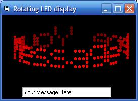



## Rotating LED display

### Description

3D-ish LED display that rotates. Looks nice!

This is kind of a cheap hack of Simon Lynn's 3D Rotating DNA project CodeId=13973 (code of the day earlier this week) Emphisis on "cheap" :-)
 
### More Info
 

             |
---                |---
**Submitted On**   |2006-06-16 22:13:46
**By**             |[Paul Bahlawan](https://github.com/Planet-Source-Code/PSCIndex/blob/master/ByAuthor/paul-bahlawan.md)
**Level**          |Beginner
**User Rating**    |5.0 (45 globes from 9 users)
**Compatibility**  |VB 5\.0, VB 6\.0
**Category**       |[Graphics](https://github.com/Planet-Source-Code/PSCIndex/blob/master/ByCategory/graphics__1-46.md)
**World**          |[Visual Basic](https://github.com/Planet-Source-Code/PSCIndex/blob/master/ByWorld/visual-basic.md)
**Archive File**   |[Rotating\_L2001416162006\.zip](https://github.com/Planet-Source-Code/paul-bahlawan-rotating-led-display__1-65691/archive/master.zip)

